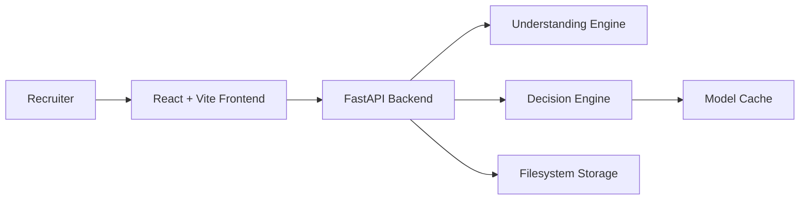
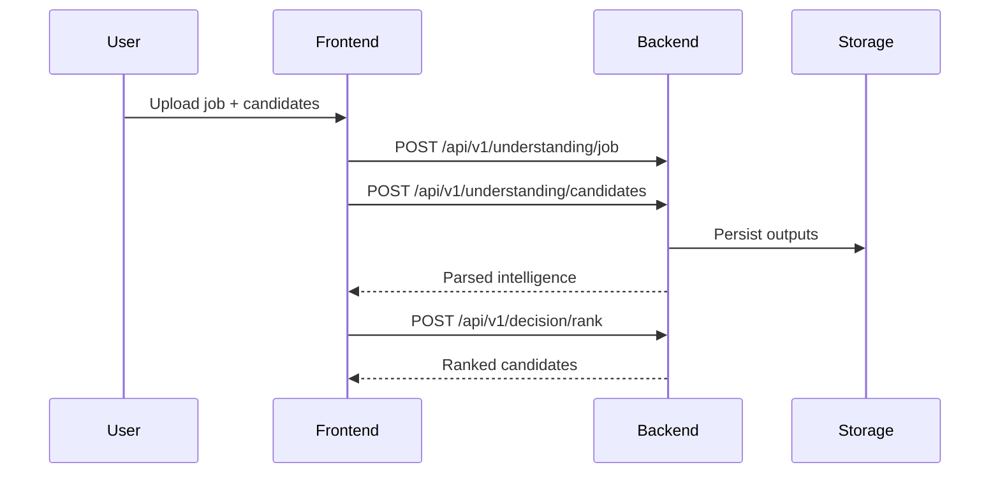

# RECI Architecture

## System Architecture

```mermaid
flowchart LR
  User[Recruiter] --> Frontend[React + Vite Frontend]
  Frontend --> API[FastAPI Backend]
  API --> Understanding[Understanding Engine]
  API --> Decision[Decision Engine]
  API --> Storage[Filesystem Storage]
  Decision --> Cache[Model Cache]
```

## Sequence

```mermaid
sequenceDiagram
  participant U as User
  participant F as Frontend
  participant B as Backend
  participant S as Storage
  U->>F: Upload job + candidates
  F->>B: POST /api/v1/understanding/job
  F->>B: POST /api/v1/understanding/candidates
  B->>S: Persist outputs
  B-->>F: Parsed intelligence
  F->>B: POST /api/v1/decision/rank
  B-->>F: Ranked candidates
```
